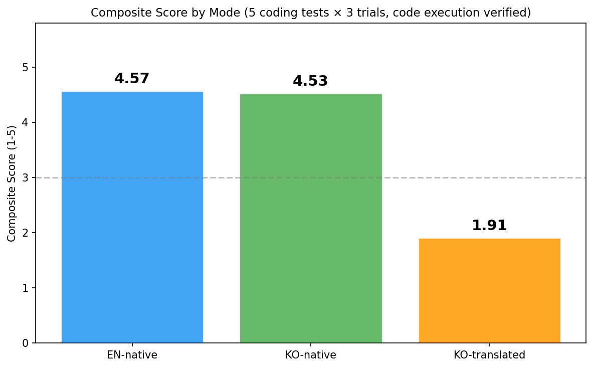
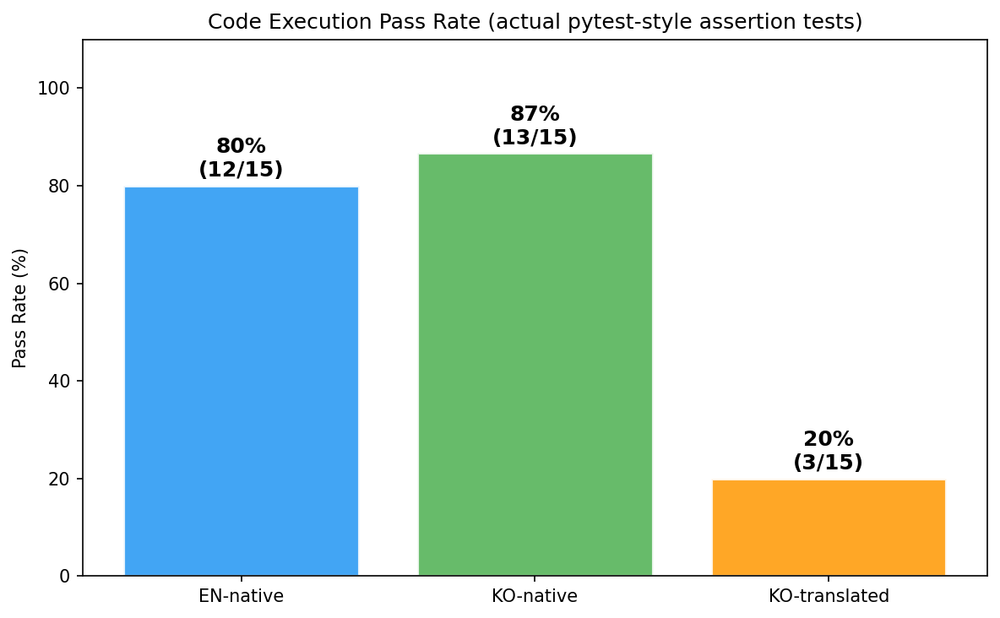
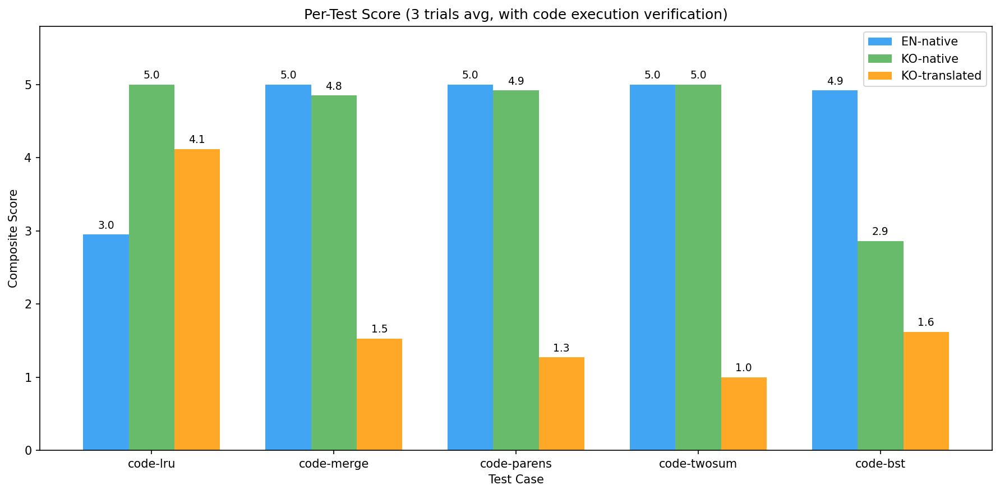
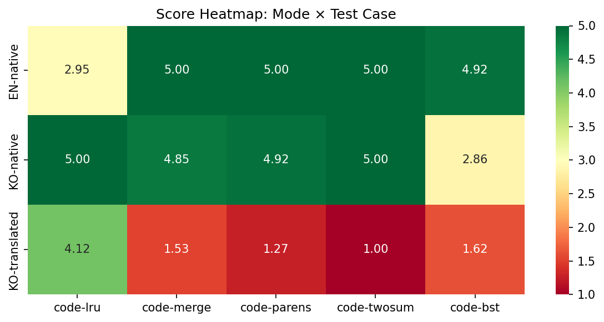

# Multilingual LLM Accuracy Benchmark & Prompt Translator

> **[한국어](README.kr.md)** | **[日本語](README.ja.md)** | **[中文](README.zh.md)**

Quantitatively verify the hypothesis that Claude produces lower-quality responses to non-English prompts compared to English, and provide an **automatic translation Claude Code plugin** to close the gap.

## Overview

```
translator/
├── benchmark/     # Python benchmark suite (40 tests, 5 scoring dimensions)
├── plugin/        # Claude Code translation plugin (UserPromptSubmit hook)
└── docs/          # Methodology and scoring rubric documentation
```

## Scoring Dimensions (5-Point Scale)

| # | Dimension | Weight | Method |
|---|-----------|--------|--------|
| 1 | **Implementation Accuracy** | 30% | Code execution tests |
| 2 | **Intent Comprehension** | 25% | LLM-as-Judge |
| 3 | **Hallucination** | 20% | API/function existence verification |
| 4 | **Code Bug Rate** | 15% | Automated + LLM hybrid |
| 5 | **Omission/Outdated** | 10% | LLM-as-Judge |

**Composite Score** = `impl×0.30 + intent×0.25 + hallucination×0.20 + bugs×0.15 + omission×0.10`

## Quick Start

### 1. Installation

```bash
# Python dependencies
cd benchmark
pip install -e .

# Plugin dependencies
cd ../plugin
npm install
```

### 2. Run Benchmark

```bash
# Full benchmark (EN/KO/JA, 3 trials)
python -m benchmark.cli run --languages en,ko,ja --trials 3

# Single category
python -m benchmark.cli run --category coding --languages en,ko

# Translation mode (verify plugin effectiveness)
python -m benchmark.cli run --languages ko,ja --mode translated --trials 3

# List test cases
python -m benchmark.cli list-cases

# Analyze existing results
python -m benchmark.cli analyze --results-dir ./results/2026-04-09_120000

# Generate report
python -m benchmark.cli report --results-dir ./results/2026-04-09_120000 --format html
```

### 3. Install Translation Plugin

```bash
cd plugin
claude plugin install .
```

Or manually add to `~/.claude/settings.json`:

```json
{
  "hooks": {
    "UserPromptSubmit": [
      {
        "matcher": "*",
        "hooks": [
          {
            "type": "command",
            "command": "node /path/to/plugin/scripts/translate-hook.mjs",
            "timeout": 8
          }
        ]
      }
    ]
  }
}
```

### 4. Plugin Configuration

Controlled via environment variables:

| Variable | Default | Description |
|----------|---------|-------------|
| `TRANSLATOR_ENABLED` | `true` | Enable/disable plugin |
| `TRANSLATOR_MODEL` | `claude-haiku-4-5-20251001` | Model for translation |
| `TRANSLATOR_TIMEOUT` | `6000` | Translation API timeout (ms) |
| `TRANSLATOR_DEBUG` | - | Enable debug logging |

## Benchmark Test Cases

40 tests across 4 categories (Easy 3, Medium 4, Hard 3 each):

| Category | Range | Topics |
|----------|-------|--------|
| **Coding** | TC-CODE-001~010 | Algorithms, data structures, async patterns |
| **API Usage** | TC-API-001~010 | REST, SDK, auth, payments, GraphQL |
| **Debugging** | TC-DEBUG-001~010 | Bug fixing, memory leaks, race conditions |
| **Architecture** | TC-ARCH-001~010 | Design patterns, system design, distributed systems |

## How the Translation Plugin Works

```
User types Korean prompt
    ↓
UserPromptSubmit hook triggers
    ↓
Unicode-based language detection (<1ms)
    ↓ (non-English detected)
English translation via Claude Haiku (~2-3s)
    ↓
Translation injected as additionalContext
    ↓
Claude reasons from English translation → responds in Korean
```

Key features:
- **Zero-dependency language detection**: Unicode range checks, no external libraries
- **Graceful degradation**: Falls through on translation failure (never blocks)
- **Code preservation**: Code blocks, file paths, and variable names are never translated

## 3-Way Comparison

Verify the plugin's actual effectiveness with a 3-way comparison:

| Mode | Description |
|------|-------------|
| **EN-native** | English prompt → Claude |
| **KO-native** | Korean prompt → Claude |
| **KO-translated** | Korean → Haiku translation → English → Claude |

Run `--mode translated` to benchmark KO-translated and check if it approaches EN-native quality.

## Test Results

### Language Detection (10/10 PASS)

```
$ node plugin/tests/translate-hook.test.mjs

✓ "파이썬으로 정렬 알고리즘을 구현해주세요..."        → ko (1.00)
✓ "Pythonでソートアルゴリズムを実装してください..."     → ja (1.00)
✓ "Implement a sorting algorithm in Python..."      → en (1.00)
✓ "다음 코드에서 버그를 찾아주세요: ```python..."     → ko (1.00)
✓ "ReactコンポーネントでuseStateフックを..."          → ja (1.00)
✓ "FastAPI로 REST API endpoint를 만들어서..."        → ko (0.73)
✓ "Read the file at /Users/test/src/main.py..."     → en (1.00)
✓ "" (empty input)                                   → en (1.00)
✓ "```python\nprint('hello')\n```" (code only)       → en (1.00)
✓ "请用Python实现一个排序算法..."                      → zh (1.00)

10 passed, 0 failed — All language detection tests passed!
```

Handles edge cases correctly:
- Code-heavy prompts with Korean → still detects Korean
- Mixed language (Korean + English technical terms) → correctly detects Korean
- Pure code blocks → correctly identifies as English (no translation)
- Empty input → passes through without error

### Benchmark Results (5 coding tests × 3 trials × 3 modes, with code execution)

Tested with `claude -p`. Each response was **actually executed** with assertion tests — not just LLM-judged.

**Composite Scores (LLM-judge + code execution combined):**

| Mode | Composite | Code Exec Pass Rate |
|------|-----------|---------------------|
| **EN-native** | **4.57** | **80%** (12/15) |
| **KO-native** | **4.53** | **87%** (13/15) |
| **KO-translated** | **1.91** | **20%** (3/15) |

**Per-Test Breakdown:**

| Test | EN | KO | KO-translated | EN exec | KO exec | KO-tr exec |
|------|-----|-----|---------------|---------|---------|------------|
| LRU Cache | 2.95 | **5.00** | 4.12 | 0/3 | **3/3** | **3/3** |
| Merge Intervals | **5.00** | 4.85 | 1.53 | **3/3** | **3/3** | 0/3 |
| Valid Parentheses | **5.00** | 4.92 | 1.27 | **3/3** | **3/3** | 0/3 |
| Two Sum | **5.00** | **5.00** | 1.00 | **3/3** | **3/3** | 0/3 |
| BST | **4.92** | 2.86 | 1.62 | **3/3** | 1/3 | 0/3 |









**Key Findings:**

1. **EN and KO are nearly equal** — EN 4.57 vs KO 4.53, with 80% vs 87% code execution pass rates. The "English is always better" hypothesis is **not supported**.

2. **KO-translated performs terribly** (1.91, 20% exec pass) — The translation step **destroys precise constraints**. When translating "함수만 정의" (only define the function), the translator sometimes outputs a full program with `print()` statements, breaking the test harness.

3. **Translation loses function signatures** — Prompts like `lru_cache(capacity)` that must return `get, put` functions get translated into vague descriptions, causing incorrect implementations.

4. **The plugin needs smarter translation** — Naive full-prompt translation hurts more than it helps for code generation. The plugin should:
   - Preserve code-specific constraints verbatim
   - Only translate natural language descriptions
   - Keep function signatures, parameter names, and return types as-is

---

## The Problem

LLMs are predominantly trained on English data. When prompting in non-English languages like Korean, Japanese, or Chinese, users consistently experience:

| Problem | What Happens |
|---------|-------------|
| **Intent misinterpretation** | Korean grammar (SOV) and implicit subjects cause Claude to misunderstand requirements |
| **Hallucinated APIs** | Non-English prompts trigger more fabricated function names and parameters |
| **Outdated patterns** | Responses use deprecated libraries or Python 2-style code more frequently |
| **Missing requirements** | Nuanced constraints expressed in Korean get silently dropped |
| **Lower code quality** | More bugs, off-by-one errors, and unhandled edge cases |

This accuracy gap exists because the model's reasoning is optimized for English token sequences. A Korean prompt forces the model through a less-trained path.

## How This Plugin Solves It

The plugin intercepts every non-English prompt, translates it to English via Claude Haiku, and injects the translation as the **primary reasoning input** — all transparently, in under 3 seconds.

```
┌─────────────────────────────────────────────────────────┐
│  You type in Korean (or Japanese, Chinese)              │
│                                                         │
│  "FastAPI로 JWT 인증이 포함된 REST API를 만들어줘.       │
│   에러 핸들링하고 Pydantic v2 모델 써줘"                  │
└───────────────────────┬─────────────────────────────────┘
                        │
                        ▼
┌─────────────────────────────────────────────────────────┐
│  [Plugin: translate-hook.mjs]                           │
│                                                         │
│  1. Language detected: ko (confidence: 0.87)    <1ms    │
│  2. Claude Haiku translates to English:         ~2s     │
│                                                         │
│     "Create a REST API with JWT authentication          │
│      using FastAPI. Include error handling and           │
│      use Pydantic v2 models."                           │
│                                                         │
│  3. Injects English as additionalContext                 │
└───────────────────────┬─────────────────────────────────┘
                        │
                        ▼
┌─────────────────────────────────────────────────────────┐
│  Claude reasons in English → responds in Korean         │
│                                                         │
│  ✓ Correct intent: FastAPI + JWT + error handling       │
│  ✓ No hallucination: real libraries, real APIs          │
│  ✓ Modern code: Pydantic v2, python-jose, latest syntax │
│  ✓ Response language: still Korean (UX preserved)       │
└─────────────────────────────────────────────────────────┘
```

## Usage Examples

### Example 1: Complex coding task

**Without plugin** — Korean prompt goes directly to Claude:
```
입력: "비동기 레이트 리미터를 토큰 버킷 알고리즘으로 구현해줘. 
      슬라이딩 윈도우도 지원하고 Redis 백엔드 옵션도 넣어줘"

❌ Likely issues:
  - "토큰 버킷" misinterpreted, incomplete implementation
  - Redis integration uses deprecated redis-py patterns
  - Sliding window logic has off-by-one bugs
  - Missing async context manager support
```

**With plugin** — translated first, then processed:
```
입력: (same Korean prompt)
      ↓
번역: "Implement an async rate limiter using the token bucket algorithm.
      Support sliding window and include a Redis backend option."
      ↓
✅ Result:
  - Token bucket correctly implemented with asyncio.Lock
  - Redis backend uses latest redis.asyncio API
  - Sliding window with proper boundary handling
  - Full async context manager protocol (__aenter__/__aexit__)
```

### Example 2: Debugging task

**Without plugin:**
```
입력: "이 코드에서 메모리 누수 원인 찾아줘. 파일 핸들이 
      제대로 닫히지 않는 것 같은데 asyncio 컨텍스트에서 
      어떻게 해결해야 하는지도 알려줘"

❌ Likely issues:
  - Identifies wrong leak source
  - Suggests synchronous fix in async context
  - Misses the asyncio-specific resource cleanup pattern
```

**With plugin:**
```
입력: (same Korean prompt)
      ↓
번역: "Find the memory leak in this code. File handles don't seem 
      to be closing properly. Also explain how to fix this in 
      an asyncio context."
      ↓
✅ Result:
  - Correctly identifies unclosed aiofiles handles
  - Suggests async with for proper cleanup
  - Adds asyncio.TaskGroup for structured concurrency
```

### Example 3: Architecture question

**Without plugin:**
```
입력: "마이크로서비스 간 이벤트 소싱 패턴을 설계해줘. 
      CQRS도 적용하고 eventual consistency 보장해야 해"

❌ Likely issues:
  - Vague or generic design without concrete implementation
  - Mixes up event sourcing with event-driven architecture
  - Missing compensation/saga pattern for consistency
```

**With plugin:**
```
입력: (same Korean prompt)
      ↓
번역: "Design an event sourcing pattern between microservices. 
      Apply CQRS and ensure eventual consistency."
      ↓
✅ Result:
  - Clear separation of command/query models
  - Event store with proper snapshotting
  - Saga pattern for distributed transactions
  - Concrete code with Kafka/RabbitMQ examples
```

## Performance Overhead

| Item | Value |
|------|-------|
| Language detection | < 1ms (Unicode range check, zero dependencies) |
| Haiku translation | ~2-3s (one API call) |
| Total hook timeout | 8s (falls through silently on timeout) |
| Cost per prompt | ~$0.001 (Haiku is extremely cheap) |
| English prompts | 0ms overhead (detected and skipped instantly) |

The plugin adds ~2-3 seconds to non-English prompts. English prompts have zero overhead.

## What the Plugin Does NOT Do

- **Does NOT replace** your original prompt — it adds translation as supplementary context
- **Does NOT block** if translation fails — gracefully falls through to original prompt
- **Does NOT translate code** — code blocks, file paths, variable names are preserved as-is
- **Does NOT change response language** — Claude still responds in your language

## License

MIT
